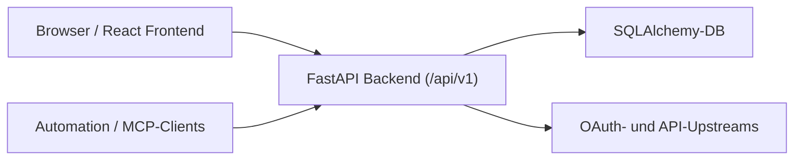

# Technische Referenz

## Stand Integration V2

- **Backend** (`backend/app/`): FastAPI mit Sessions, Microsoft-Enduser-Login (OAuth: vollständige Konfiguration in `microsoft_oauth_settings` mit verschlüsseltem Client-Secret, sonst Fallback auf `MICROSOFT_BROKER_*`), Integrations-API V2: **Anlegen** von Integrationen/Instanzen und **session-basiertes** `discover-tools` nur für Admin; Listen und `execute` für alle Nutzer der Organisation. **`GET /api/v1/integration-instances/{id}/inspect`**: Instanz, zugehörige Integration und optional `user_connection` mit Profilfeldern aus `metadata_json` (nach erfolgreichem Integration-OAuth befüllt; Microsoft Graph: Profil primär über **`GET https://graph.microsoft.com/v1.0/me`**, ergänzend `id_token`-Claims). **Integration-OAuth-Connect** (`integration_oauth`): Nutzer starten OAuth zum Zielsystem pro `IntegrationInstance` (Template `miro_default` / `microsoft_graph_default`). **Microsoft Graph** (Entra): Redirect-URI `GET .../connections/microsoft-graph/callback` (oder `…/integration-instances/oauth/callback`, gleicher Handler); konfigurierbar via `MICROSOFT_GRAPH_OAUTH_REDIRECT_URI` / `MICROSOFT_GRAPH_OAUTH_REDIRECT_PATH` / `config_json.graph_oauth_redirect_uri`. **Miro**: Redirect `GET .../integration-instances/oauth/callback`. `GET /api/v1/broker-callback-urls`: `microsoft_graph` vs. `integration_oauth`/`miro`. **Microsoft Graph**: Standard `resolve_microsoft_oauth` (Broker-Login-App); optional eigene Entra-App über `PATCH /api/v1/integrations/{id}` (`config_json`: `graph_oauth_use_broker_defaults`, `graph_oauth_*`, verschlüsseltes Client-Secret am Integrationsmodell). **Miro**: dynamische Client-Registrierung am Registration-Endpoint (`oauth_registration_endpoint`, `oauth_dynamic_client_registration_enabled`), PKCE; Token-Austausch am MCP-Authorization-Server (`oauth_token_endpoint`, z. B. `{miro_mcp_base}/token`, nicht `https://api.miro.com/v1/oauth/token` für MCP-DCR); alternativ statische `MIRO_OAUTH_*` oder `oauth_client_id`/`oauth_client_secret` in `Integration.config_json` (klassische Miro-App ggf. klassische Token-URL). **AccessGrant** (Broker-Access-Keys, gehasht gespeichert): `GET/POST /api/v1/access-grants`, `POST /api/v1/access-grants/validate`, `POST .../revoke`. **Consumer-Ausführung** (ohne Browser-Session): `POST /api/v1/consumer/integration-instances/{id}/execute` und `.../discover-tools` mit `X-Broker-Access-Key` oder `Authorization: Bearer bkr_...` — getrennt von Upstream-Auth (`X-User-Token` / gespeicherte UserConnection). **Direct Token Access:** `POST /api/v1/consumer/integration-instances/{id}/token` mit Broker-Access-Key, nur bei Grant-Flag `direct_token_access` und OAuth-Connection; Response ohne Refresh Token, optional `email` / `username` aus Connection-Metadaten. **UserConnection** optional für OAuth-Upstream pro Nutzer-Instanz.
- **Admin-API**: `GET/PUT /api/v1/admin/microsoft-oauth` (Admin-Session, `PUT` mit `X-CSRF-Token`); **Benutzerverwaltung** `GET /api/v1/admin/users` (Filter `status`, `q`, `provider_key`, Pagination), `GET /api/v1/admin/users/{id}` (Detail inkl. Sessions, Connections, Access Grants, OAuth-Identities); schreibend mit `X-CSRF-Token`: `POST .../deprovision`, `POST .../soft-delete`, `POST .../reactivate`, `POST .../sessions/revoke-all`, `POST .../sessions/{session_id}/revoke`, `POST .../access-keys/revoke-all`, `DELETE .../users/{id}` mit JSON `{ "confirm_email" }` (Hard Delete); `PATCH /api/v1/integrations/{id}` (Graph-`config_json`-Merge, optionales Client-Secret für eigene Entra-App); **Broker-Login-Provider** `GET/POST/PATCH/DELETE /api/v1/admin/broker-login-providers` (OIDC-Anmeldung am Workspace).
- **Frontend** (`frontend/`): React/Vite, Einstieg `/workspace/integrations-v2`; Verbindungen `/workspace/connections`; Broker-Zugang (Access Keys) `/workspace/broker-access`; Admins zusätzlich `/workspace/admin/users`, `/workspace/admin/microsoft-oauth`, `/workspace/admin/login-providers`.
- **`src/`**: Node-Referenzcode und Tests, nicht der deployte Laufzeitpfad des Brokers.

## Architekturueberblick



## Frontend

### Technologie

- React 18
- TypeScript
- Vite
- Routing über `window.location.pathname` und `matchesRoute` in `App.tsx`

### Zentrale Dateien

- `frontend/src/App.tsx` — Routing, Login, Workspace-Shell
- `frontend/src/api.ts` — HTTP zu `/api/v1`
- `frontend/src/app-context.tsx` — Session, Login/Logout, Toasts
- `frontend/src/components.tsx` — gemeinsame UI-Bausteine

### Workspace-Routen (authentifiziert)

- `/workspace/integrations-v2` — Integrationen und Instanzen
- `/workspace/connections` — OAuth-Verbindungen je Instanz
- `/workspace/broker-access` — Access Grants (Broker Access Keys)

Admin (zusätzlich, nur `is_admin`):

- `/workspace/admin/users`
- `/workspace/admin/microsoft-oauth`
- `/workspace/admin/login-providers`

Anonym: `/` oder `/login` zeigen die Sign-in-Seite (siehe `matchesRoute` in `frontend/src/utils.ts`).

## Backend

### Einstiegspunkt

- `backend/app/main.py`

### Registrierte Router (alle mit `settings.api_v1_prefix`, üblicherweise `/api/v1`)

| Modul | Inhalt (Kurz) |
|-------|-----------------|
| `public` | Health, Callback-URLs, Login-Optionen |
| `auth` | Login, Logout, Broker-Login Start/Callback, Session |
| `integrations_v2` | Integrationen, Instanzen, Admin-Lifecycle |
| `integration_oauth` | OAuth Start/Callback/Disconnect pro Instanz |
| `access_grants` | Access Grants (Browser-Session) |
| `consumer_execution` | `execute`, `discover-tools` |
| `consumer_token` | Direct Token Access |
| `consumer_mcp_relay` | MCP Relay (streamable HTTP) |
| `admin_microsoft_oauth` | Microsoft Sign-in-Konfiguration |
| `admin_login_providers` | OIDC Sign-in-Provider |
| `admin_users` | Nutzerverwaltung |

Es gibt keinen `legacy_miro`-Router mehr; Miro-Nutzung für Consumer läuft über Integration-Instanz, Access Grant und Consumer-Routen.

### Konfiguration

Die Konfiguration wird in `backend/app/core/config.py` über Umgebungsvariablen geladen.

Wichtige Variablen:

- `DATABASE_URL`
- `BROKER_PUBLIC_BASE_URL`
- `FRONTEND_BASE_URL`
- `CORS_ORIGINS`
- `SESSION_SECRET`
- `SESSION_SECURE_COOKIE`
- `BROKER_ENCRYPTION_KEY`
- `BOOTSTRAP_ADMIN_EMAIL`
- `BOOTSTRAP_ADMIN_PASSWORD`
- `MICROSOFT_BROKER_*`
- Miro-/Integrations-Defaults: `MIRO_*`, siehe Konfiguration und `default_integrations`

Besonderheit:

- Wenn `BROKER_ENCRYPTION_KEY` nicht gesetzt ist, wird er aus `SESSION_SECRET` abgeleitet.

## Datenhaltung

### Datenbank

SQLAlchemy mit konfigurierbarer Datenbank (lokal oft SQLite, in Docker typischerweise PostgreSQL).

### Zentrale Entitäten (`backend/app/models.py`)

- **Organization** — Mandant
- **User** — Konten inkl. Admin-Flag; Soft-Delete / Lifecycle über Admin-API
- **Session** — Session-Cookie, CSRF
- **OAuthIdentity** — externe Identitäten (z. B. Microsoft Login)
- **MicrosoftOAuthSettings** — Entra-App für Broker-Login (optional DB-gestützt)
- **BrokerLoginProvider** — zusätzliche OIDC-Provider für Broker-Login
- **Integration** — Integrationsdefinition (Typ, Auth, Endpunkte, Konfiguration)
- **IntegrationInstance** — konkrete Instanz je Organisation
- **UserConnection** — OAuth-Token und Metadaten pro Nutzer und Instanz
- **AccessGrant** — Broker Access Key (nur Hash gespeichert); optional Ablauf, Tool-Liste, `direct_token_access`
- **IntegrationTool** — Tool-Metadaten für Execution/Policy
- **OAuthPendingState** — OAuth-State über Requests hinweg
- **AuditEvent** — Audit-Log

## Seed und Initialisierung

Beim Start wird `init_db()` aus `backend/app/seed.py` ausgeführt.

Dabei werden:

- die Datenbanktabellen erzeugt oder angeglichen (`reconcile_schema`)
- eine Default-Organisation angelegt
- ein Bootstrap-Admin erzeugt (sofern konfiguriert)
- vordefinierte V2-Integrationen und -Instanzen angelegt (`ensure_default_integrations` in `default_integrations.py`), falls noch nicht vorhanden

Vordefinierte Integrationen (stabile IDs, pro Default-Organisation):

- **Miro MCP** (`Integration` `mcp_server`, MCP aktiv): Upstream-Endpoint aus `MIRO_*` / `miro_mcp_base`, Instanz mit Upstream-Auth `oauth`.
- **Microsoft Graph** (`Integration` `oauth_provider`, MCP nicht aktiv): OAuth-Metadaten und Graph-Basis-URL; Instanz mit `oauth` für Ressourcenzugriff über Nutzer-Token.

## Authentifizierung und Sessions

### Admin-Login (lokal)

1. `POST /api/v1/auth/login`
2. Backend prüft E-Mail und Passwort gegen `users`
3. Session wird erzeugt
4. Session-Cookie wird gesetzt
5. CSRF-Token wird in der Response zurückgegeben

### SSO-Login für Endnutzer (Broker)

Provider-agnostisch über `provider_id` (z. B. `microsoft` für Entra, oder Einträge aus `broker_login_providers` für OIDC).

1. `GET /api/v1/auth/login-options` liefert `login_providers` (`id`, `display_name`)
2. `POST /api/v1/auth/{provider_id}/start`
3. Pending-State `broker_login` (u. a. PKCE, `nonce`, Correlation-ID)
4. Redirect zur IdP-Authorize-URL
5. `GET /api/v1/auth/{provider_id}/callback`
6. Token-Austausch, Claim-Mapping, `users` / `oauth_identities`, Session-Cookie, Redirect z. B. nach `/workspace/integrations-v2?login_status=success`

Microsoft über `microsoft_oauth_settings` bzw. `MICROSOFT_BROKER_*`; weitere OIDC-Provider über `/api/v1/admin/broker-login-providers`.

## Integration-OAuth (Miro, Graph, generisch)

Implementierung: `backend/app/routers/integration_oauth.py` (und Hilfen in `upstream_oauth.py`).

Kurzablauf:

1. Nutzer startet `POST /api/v1/integration-instances/{id}/oauth/start` (Session, CSRF)
2. Redirect zum Provider
3. Callback `GET /api/v1/integration-instances/oauth/callback` (und Microsoft-Graph-Variante mit gleichem Handler je nach konfiguriertem Pfad)
4. Token werden in `user_connections` gespeichert; Profilfelder in `metadata_json`

Disconnect: `POST .../oauth/disconnect`.

## Consumer-Zugriff (ohne Browser-Session)

Voraussetzung: gültiger **Access Grant**, Broker Access Key im Header (`X-Broker-Access-Key` oder `Authorization: Bearer bkr_...`).

| Zweck | Methode | Pfad |
|--------|---------|------|
| Tool-Ausführung | POST | `/api/v1/consumer/integration-instances/{id}/execute` |
| Tool-Discovery | POST | `/api/v1/consumer/integration-instances/{id}/discover-tools` |
| MCP Relay (streamable HTTP) | ANY | `/api/v1/consumer/integration-instances/{id}/mcp` (+ optionale Subpfade) |
| Upstream-OAuth-Access-Token | POST | `/api/v1/consumer/integration-instances/{id}/token` (nur mit Grant-Flag `direct_token_access`, OAuth-Connection) |

Antwort u. a. `access_token`, optional `expires_at` / `expires_in`, `connection_id`, **`connection_name`** (Integration Instance), **`access_name`** (Access Grant), optional Profilfelder aus der Connection.

Verbindungsinfo für MCP: `GET .../mcp-connection-info` (siehe Consumer-Router).

Details und Fehlerbilder: `docs/troubleshooting-consumer-mcp-relay.md`.

## API-Übersicht (Auszug)

### Public

- `GET /api/v1/health`
- `GET /api/v1/broker-callback-urls`
- `GET /api/v1/auth/login-options`

### Auth

- `POST /api/v1/auth/login`, `POST /api/v1/auth/logout`
- `POST /api/v1/auth/{provider_id}/start`, `GET /api/v1/auth/{provider_id}/callback`
- `GET /api/v1/sessions/me`

### Integrations V2 & OAuth

- Integrationen/Instanzen: siehe OpenAPI (`GET/POST/PATCH/DELETE` je nach Rolle)
- `integration_oauth`: Start, Callback, Disconnect

### Access Grants

- `GET/POST /api/v1/access-grants`, `POST .../validate`, Revoke/Löschen nach API

### Consumer

- `execute`, `discover-tools`, `mcp`, `token` wie oben

### Admin

- `admin_microsoft_oauth`, `admin_login_providers`, `admin_users` — siehe OpenAPI

Die vollständige Liste liefert die interaktive Dokumentation: `/api/v1/docs`.

## Security-Modell

### Session und CSRF

- authentifizierte Browser-Requests verwenden Cookies
- schreibende Session-Requests verwenden zusätzlich `X-CSRF-Token`

### Geheimnisse

- Broker Access Keys nur als Hash gespeichert; Klartext nur bei Erstellung
- OAuth-Tokens und Client-Secrets verschlüsselt in der DB, wo vorgesehen

### Rollen

- `require_admin` schützt Admin-Endpunkte und kritische Integrationsänderungen
- Consumer-Routen prüfen Grant, Organisation und Tool-Policy

## Referenzcode unter `src/`

`src/` enthält älteren Node-Code für Tests und Vergleich, nicht den produktiven Python-Pfad.

## Lokale Entwicklung

### Broker-Stack

```bash
cd backend
pip install -r requirements.txt
uvicorn app.main:app --reload
```

```bash
cd frontend
npm install
npm run dev
```

### Docker-Stack

```bash
docker compose up -d --build
```

Keycloak-Tests: Profil `test` in `docker-compose.yml`, siehe `docs/runbook-broker-login-testing.md`.

## Verifikation und Tests

```bash
node --test
# oder
npm test
```

```bash
python3 -m py_compile backend/app/*.py backend/app/routers/*.py backend/app/core/*.py
PYTHONPATH=backend python3 -m unittest backend.test_smoke -v
```

Broker-Login (Mocks): `PYTHONPATH=backend python3 -m unittest backend.test_broker_login_flow backend.test_broker_login -v`

## Grenzen und Hinweise

- Consumer-Ausführung ohne gültiges Upstream-OAuth schlägt mit passenden API-Fehlern fehl (`oauth_upstream_token_missing` o. ä.).
- MCP-Relay erfordert MCP-fähige Integration und passenden Access-Modus; siehe `docs/troubleshooting-consumer-mcp-relay.md`.
- `src/` ist Referenz; produktive Integration läuft über FastAPI und das React-Frontend.
