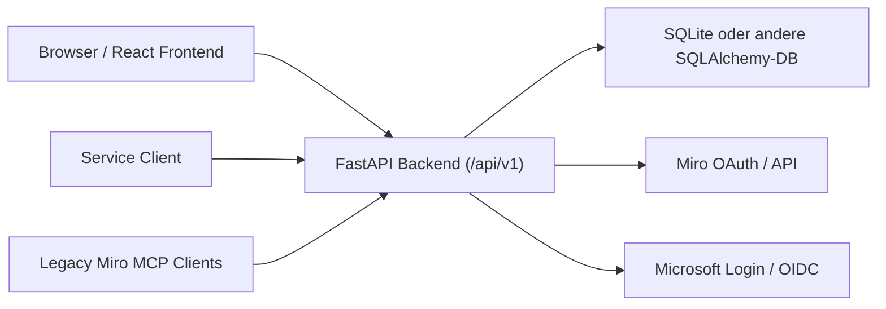

# Technische Referenz

## Stand Integration V2

- **Backend** (`backend/app/`): FastAPI mit Sessions, Microsoft-Enduser-Login (OAuth: vollständige Konfiguration in `microsoft_oauth_settings` mit verschlüsseltem Client-Secret, sonst Fallback auf `MICROSOFT_BROKER_*`), Integrations-API V2: **Anlegen** von Integrationen/Instanzen und **session-basiertes** `discover-tools` nur für Admin; Listen und `execute` für alle Nutzer der Organisation. **AccessGrant** (Broker-Access-Keys, gehasht gespeichert): `GET/POST /api/v1/access-grants`, `POST /api/v1/access-grants/validate`, `POST .../revoke`. **Consumer-Ausführung** (ohne Browser-Session): `POST /api/v1/consumer/integration-instances/{id}/execute` und `.../discover-tools` mit `X-Broker-Access-Key` oder `Authorization: Bearer bkr_...` — getrennt von Upstream-Auth (`X-User-Token` / gespeicherte UserConnection). **UserConnection** optional für OAuth-Upstream pro Nutzer-Instanz.
- **Admin-API**: `GET/PUT /api/v1/admin/microsoft-oauth` (Admin-Session, `PUT` mit `X-CSRF-Token`).
- **Frontend** (`frontend/`): React/Vite, Einstieg `/workspace/integrations-v2`; Microsoft-OAuth-Setup für Admins unter `/workspace/admin/microsoft-oauth`; Broker-Zugang (Access Keys) unter `/workspace/broker-access`.
- **`src/`**: veralteter Node-Referenzcode, nicht der deployte Laufzeitpfad.

Aeltere Abschnitte weiter unten in diesem Dokument koennen noch historische Begriffe enthalten; sie gelten nicht mehr fuer den aktiven Stack.

## Architekturueberblick (Legacy-Abschnitt unten teils veraltet)

Das Repository umfasst drei relevante Codebereiche:

- `frontend/`
  React/Vite-Single-Page-App fuer Admin- und Self-Service-Oberflaechen

- `backend/app/`
  FastAPI-Backend fuer Sessions, Provider-Verwaltung, Connected Accounts, Delegation Grants, Token-Issuance und Audit

- `backend/app/routers/legacy_miro.py`
  FastAPI-Kompatibilitaetsschicht fuer historische Miro-Endpunkte wie `/miro/mcp/{profile_id}`, `/healthz` und `/readyz`

`src/` enthaelt weiterhin historischen Node-Code, ist aber nicht mehr der vorgesehene Laufzeitpfad der aktuellen Anwendung.

## Architekturprinzipien

- Trennung zwischen Benutzeroberflaeche, Broker-Logik und Legacy-Kompatibilitaet
- serverseitige Speicherung sensibler Tokenmaterialien
- explizite Freigabe von Servicezugriffen ueber Service-Clients und Delegation Grants
- klare Auditierbarkeit aller relevanten Zustandsaenderungen und Zugriffsvorgaenge
- Rueckwaertskompatibilitaet fuer bestehende Miro-MCP-Clients ueber FastAPI-Routen

## Laufzeitarchitektur



## Frontend

### Technologie

- React 18
- TypeScript
- Vite
- clientseitige Routing-Logik auf Basis von `window.location.pathname`

### Zentrale Dateien

- `frontend/src/App.tsx`
  enthaelt Routing, Seitenlogik und Rollentrennung zwischen Admin und Endnutzer

- `frontend/src/api.ts`
  kapselt alle HTTP-Aufrufe gegen `/api/v1`

- `frontend/src/app-context.tsx`
  verwaltet Session-Zustand, Login/Logout und Toasts

- `frontend/src/components.tsx`
  wiederverwendbare UI-Bausteine

### Routing-Modell

Die App verwendet keinen externen Router; das Routing ist in der Anwendung implementiert.

Admin-Routen:

- `/app`
- `/app/providers`
- `/app/connections`
- `/app/delegation`
- `/app/audit`

Self-Service-Routen:

- `/workspace`
- `/workspace/integrations`
- `/workspace/clients`
- `/grants`
- `/token-access`

Rollenselektion:

- Endnutzer werden aus Admin-Routen nach `/workspace` umgeleitet
- Admins können Self-Service unter `/workspace` nutzen (z. B. OAuth-Rückkehr); die Admin-Konsole bleibt unter `/app`

## Backend

### Technologie

- FastAPI
- SQLAlchemy ORM
- Pydantic / pydantic-settings
- httpx fuer externe OAuth- und Provider-Requests

### Einstiegspunkt

- `backend/app/main.py`

Das Backend registriert folgende Router unter `/api/v1`:

- `public`
- `auth`
- `connections`
- `token_issuance`
- `user`
- `admin`

Zusaetzlich bindet `backend/app/main.py` den Router `legacy_miro` ohne `/api/v1`-Prefix ein. Darueber laufen die kompatiblen Endpunkte `/miro/*`, `/healthz` und `/readyz`.

### Konfiguration

Die Konfiguration wird in `backend/app/core/config.py` ueber Umgebungsvariablen geladen.

Wichtige Variablen:

- `DATABASE_URL`
- `BROKER_PUBLIC_BASE_URL`
- `FRONTEND_BASE_URL`
- `CORS_ORIGINS`
- `SESSION_SECRET`
- `SESSION_SECURE_COOKIE`
- `BROKER_ENCRYPTION_KEY`
- `BOOTSTRAP_ADMIN_EMAIL`
- `BOOTSTRAP_ADMIN_PASSWORD`
- `MICROSOFT_BROKER_*`
- `MIRO_OAUTH_SCOPE`
- `MIRO_OAUTH_EMAIL_MODE`
- `MIRO_RETRY_COUNT`
- `MIRO_BREAKER_FAIL_THRESHOLD`
- `MIRO_BREAKER_OPEN_MS`

Besonderheit:

- Wenn `BROKER_ENCRYPTION_KEY` nicht gesetzt ist, wird er aus `SESSION_SECRET` abgeleitet.

## Datenhaltung

### Datenbank

Die neue Broker-Anwendung nutzt SQLAlchemy mit einer konfigurierbaren Datenbank.

Standard lokal:

- `sqlite:///./broker.db`

### Wichtige Entitaeten

Die zentralen Tabellen sind in `backend/app/models.py` definiert.

#### Organization

- organisatorische Mandantentrennung

#### User

- Benutzerkonto innerhalb einer Organisation
- kann Admin oder Endnutzer sein

#### Session

- serverseitige Session mit gehashtem Session-Token und CSRF-Token

#### ProviderDefinition

- abstrakter Providertyp, z. B. Miro oder Microsoft

#### ProviderInstance

- konkrete technische Instanz eines Providers

#### ProviderApp

- Richtlinienobjekt fuer Downstream-Zugriff
- enthaelt unter anderem Scopes, Access-Mode und Flags fuer Relay oder Direct Token

#### UserAuthIdentity

- Verknuepfung eines Benutzers mit externer Identitaet, insbesondere fuer Microsoft-Login

#### ConnectedAccount

- konkrete Benutzerverbindung zu einer Provider-App

#### TokenMaterial

- verschluesseltes Access- und Refresh-Token zu einer Verbindung

#### ServiceClient

- technischer Verbraucher des Brokers mit Shared Secret; optional `created_by_user_id` (Besitzer); Verwaltung durch den jeweiligen Nutzer

#### DelegationGrant

- delegierte Zugriffsfreiabe zwischen Benutzer, Service-Client und Provider-App

#### GrantedCapability

- optionale feingranulare Zusatzfaehigkeiten pro Grant

#### TokenIssueEvent

- Diagnostik- und Historieneintrag fuer Zugriffsausgaben und Relay-Entscheidungen

#### AuditEvent

- allgemeines Audit-Logging fuer Zustandsaenderungen

## Seed und Initialisierung

Beim Start wird `init_db()` aus `backend/app/seed.py` ausgefuehrt.

Dabei werden:

- die Datenbanktabellen erzeugt
- eine Default-Organisation angelegt
- ein Bootstrap-Admin erzeugt (sofern konfiguriert)
- vordefinierte V2-Integrationen und -Instanzen angelegt (`ensure_default_integrations` in `default_integrations.py`), falls noch nicht vorhanden

Vordefinierte Integrationen (stabile IDs, pro Default-Organisation):

- **Miro MCP** (`Integration` `mcp_server`, MCP aktiv): Upstream-Endpoint aus `MIRO_*` / `miro_mcp_base`, Instanz mit Upstream-Auth `oauth` (Nutzer-Token an den MCP).
- **Microsoft Graph** (`Integration` `oauth_provider`, MCP nicht aktiv): OAuth-Metadaten (Authorize/Token-URL aus Broker-Einstellungen) und Graph-Basis-URL; Instanz mit `oauth` fuer Ressourcen-Zugriff ueber Nutzer-Token — kein MCP-`discover_tools` bis ein MCP-faehiger Endpoint angebunden wird.

## Authentifizierung und Sessions

### Admin-Login

Flow:

1. `POST /api/v1/auth/login`
2. Backend prueft E-Mail und Passwort gegen `users`
3. Session wird erzeugt
4. Session-Cookie wird gesetzt
5. CSRF-Token wird in der Response zurueckgegeben

### Microsoft-Login fuer Endnutzer

Flow:

1. Frontend ruft `POST /api/v1/auth/microsoft/start` auf
2. Backend erzeugt `state`, `nonce` und PKCE-Werte
3. Browser wird zu Microsoft weitergeleitet
4. Callback landet auf `GET /api/v1/auth/microsoft/callback`
5. Backend tauscht Code gegen Tokens, validiert Claims und ordnet den Benutzer zu oder legt ihn an
6. Session-Cookie wird gesetzt
7. Redirect auf `/workspace?login_status=success`

Sicherheitsmerkmale:

- PKCE
- `state`-Pruefung
- Nonce-Pruefung
- serverseitige Session
- CSRF-Schutz fuer schreibende Requests

## Miro-Connect-Flow

Der Miro-Flow ist in `backend/app/routers/connections.py` und `backend/app/miro.py` implementiert.

Flow:

1. Frontend ruft `POST /api/v1/connections/miro/start`
2. Backend erstellt oder erneuert einen Pending-State fuer den OAuth-Flow
3. Browser wird zu Miro weitergeleitet
4. Callback kommt auf `GET /api/v1/connections/miro/callback`
5. Das Backend tauscht den Code gegen Tokenmaterial
6. Die erkannte Provider-Identitaet wird geprueft
7. `ConnectedAccount` und `TokenMaterial` werden angelegt oder aktualisiert
8. Redirect zurueck ins Frontend auf `/workspace/integrations` mit Statusparametern

Stand Self-Service und Miro:

- Self-Service-Connect ist fuer Miro umgesetzt
- Refresh und Probe sind fuer Miro implementiert

## Delegation und Servicezugriff

### Grundprinzip

Zugriff erfolgt mit einem Access Credential (Klartext), das an einen konkreten Grant gebunden ist und im HTTP-Header `X-Access-Key` uebergeben wird (Abwaertskompatibilitaet: `X-Delegated-Credential`). Optional kann der Grant an einen Service-Client gebunden sein; dann kann zusaetzlich `X-Service-Secret` zur Abwaertskompatibilitaet verlangt werden. Grants ohne Service-Client reichen mit `X-Access-Key` allein.

### Direct Token Issuance

Endpunkt:

- `POST /api/v1/token-issues/provider-access`

Header:

- `X-Access-Key` (Pflicht; Abwaertskompatibilitaet `X-Delegated-Credential`)
- `X-Service-Secret` (optional, z. B. bei aelteren Grants mit Service-Client-Bindung)

Payload:

- `provider_app_key`
- optionale `requested_scopes`
- optional `connected_account_id`

Das Backend prueft unter anderem:

- optional Service-Client-Abgleich, wenn mitgegeben
- Gueltigkeit des Grants
- erlaubten Access-Mode
- Scope-Grenzen
- Zugehoerigkeit zu Provider-App und Connected Account

Danach wird entweder:

- ein Zugriffstoken ausgegeben oder
- der Zugriff blockiert

Beide Faelle werden in `TokenIssueEvent` und `AuditEvent` dokumentiert.

### Relay-Zugriff fuer Miro

Endpunkt:

- `POST /api/v1/broker-proxy/miro/{connected_account_id}`

`X-Access-Key` ist Pflicht (Abwaertskompatibilitaet `X-Delegated-Credential`); `X-Service-Secret` optional (siehe Direct Token). Der Broker validiert die Berechtigung und leitet den Request danach gegen Miro weiter.

Pro Miro-Verbindung liegt der Relay-Key als `legacy_relay_token_hash` (Lookup bei der Verifizierung) und als `encrypted_legacy_relay_token` (Fernet, `BROKER_ENCRYPTION_KEY`) vor. Klartext an den Kontoinhaber: `GET /api/v1/connections/{id}/miro-access` und `GET /api/v1/connections/{id}/access-details` nach Session-Authentifizierung, sofern der Ciphertext gespeichert ist.

## API-Struktur

### Public

- `GET /api/v1/health`
- `GET /api/v1/provider-definitions`

### Auth

- `POST /api/v1/auth/login`
- `POST /api/v1/auth/microsoft/start`
- `GET /api/v1/auth/microsoft/callback`
- `POST /api/v1/auth/logout`
- `GET /api/v1/sessions/me`

### User / Self-Service

- `GET /api/v1/provider-apps`
- `GET /api/v1/connections`
- `POST /api/v1/connections/miro/start`
- `GET /api/v1/connections/miro/callback`
- `POST /api/v1/connections/{id}/refresh`
- `POST /api/v1/connections/{id}/revoke`
- `POST /api/v1/connections/{id}/probe`
- `GET/POST/PATCH/DELETE /api/v1/service-clients` (eigene Clients; Schreibzugriffe mit CSRF)
- `POST /api/v1/service-clients/{id}/rotate-secret`
- `GET /api/v1/delegation-grants`
- `POST /api/v1/delegation-grants`
- `GET /api/v1/delegation-grants/{id}/access-credential` (Legacy-Pfad: `.../delegated-credential`)
- `POST /api/v1/delegation-grants/{id}/rotate-credential`
- `POST /api/v1/delegation-grants/{id}/revoke`
- `GET /api/v1/token-issues`

### Admin

- `GET /api/v1/admin/users`
- `GET/POST /api/v1/admin/provider-instances`
- `GET/POST /api/v1/admin/provider-apps`
- `GET /api/v1/admin/connected-accounts`
- `POST /api/v1/admin/connected-accounts/manual`
- `GET /api/v1/admin/service-clients` (Organisation, Leselist)
- `GET /api/v1/admin/users/{user_id}/service-clients`
- `GET/POST /api/v1/admin/delegation-grants`
- `POST /api/v1/admin/delegation-grants/{id}/revoke`
- `GET /api/v1/admin/audit`
- `GET /api/v1/admin/token-issues`
- `GET /api/v1/admin/migrations/miro/status`
- `POST /api/v1/admin/migrations/miro/import`

## Security-Modell

### Session und CSRF

- authentifizierte Browser-Requests verwenden Cookies
- schreibende Requests verwenden zusaetzlich `X-CSRF-Token`

### Secret-Handling

- Service-Client-Secrets werden nur gehasht gespeichert
- Access Credentials (Delegation-Grants) werden nur gehasht gespeichert
- Provider-Tokens und Client-Secrets werden verschluesselt gespeichert

### Rollen

- `require_admin` schuetzt Admin-Endpunkte
- normale Benutzer koennen nur auf eigene Verbindungen, Grants und Token-Issue-Historie zugreifen

## Legacy-Node-Quelle

`src/index.js` enthaelt weiterhin den urspruenglichen Node/Express-Prototypen des Miro-Relay.

Merkmale:

- Express-Anwendung
- dateibasierte Persistenz unter `data/`
- historische Health-, Ready- und Relay-Endpunkte
- historischer Browser-Flow fuer Miro

Fuer die aktuelle Anwendung ist dieser Code vor allem Referenzmaterial und Grundlage fuer die kleinen Node-Platform-Tests. Die produktiv relevante Kompatibilitaet fuer bestehende Miro-Clients wird heute im FastAPI-Backend bereitgestellt.

## Lokale Entwicklung

### Aktueller Stack

```bash
cd backend
pip install -r requirements.txt
uvicorn app.main:app --reload
```

```bash
cd frontend
npm install
npm run dev
```

### Legacy-Node-Prototyp (optional)

```bash
npm install
npm start
```

Dieser Startpfad ist nur fuer Altvergleiche oder gezielte Referenzpruefungen sinnvoll, nicht fuer den regulaeren Broker-Stack.

### Docker-Stack

```bash
docker compose up -d --build
```

## Verifikation und Tests

### Node-Referenztests

```bash
node --test
```

### Backend

```bash
python3 -m py_compile backend/app/*.py backend/app/routers/*.py backend/app/core/*.py
python3 -m unittest backend/test_welle1_smoke.py
```

## Bekannte Grenzen

- Der generische Broker ist modellseitig vorbereitet; der Self-Service-Connect ist auf Miro fokussiert.
- Connection-Probe und Refresh sind fuer Miro implementiert.
- Das Frontend setzt In-App-Routing ohne externe Router-Bibliothek ein.
- Das Repository enthaelt weiterhin historischen Node-Code; der aktive Integrationspfad fuer Browser, Service-Clients und Legacy-MCP-Clients laeuft aber ueber das FastAPI-Backend.
