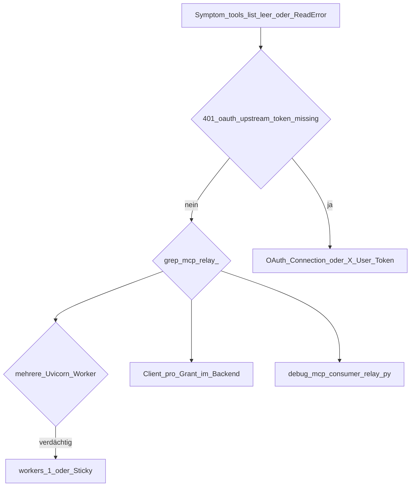

# Consumer-MCP-Relay (Streamable HTTP)

Route: `ANY /api/v1/consumer/integration-instances/{instance_id}/mcp` (optional Pfad-Suffix). Implementierung: [`backend/app/routers/consumer_mcp_relay.py`](../backend/app/routers/consumer_mcp_relay.py).

## Symptome

- JSON-RPC `tools/list` liefert HTTP 200, Antwortbody wirkt leer; MCP-Clients melden Timeout oder hängende `list_tools`.
- Log: `mcp_relay_upstream_stream_closed` oder `httpx.ReadError` beim Streamen.
- HAProxy-Logs: `SD--` (Server hat die Verbindung während der Antwort beendet).

## Typische Ursachen

1. **401 `oauth_upstream_token_missing`** — Für die Integration ist `auth_mode=oauth`, es fehlt aber eine gültige User-Connection / kein `X-User-Token`, wenn der Grant keine gebundene Connection hat.
2. **Streamable-HTTP und TCP** — Manche Upstreams (z. B. Miro MCP) erwarten dieselbe HTTP-Verbindung für `initialize` und Folge-POSTs. Pro Relay-Request einen neuen `httpx.AsyncClient` zu öffnen kann dazu führen, dass Folgeanfragen keinen nutzbaren Body liefern. Der Broker hält einen **wiederverwendeten `AsyncClient` pro Access-Grant** (LRU, begrenzte Größe).
3. **Mehrere Uvicorn-Worker** — Jeder Worker hat einen eigenen Client-Pool. Derselbe Grant kann auf verschiedene Worker verteilt werden; dann entstehen wieder getrennte Upstream-Verbindungen. Test mit `--workers 1` oder Lastverteiler mit Sticky Session zum Broker-Backend.
4. **Proxy-Timeouts** — In [`haproxy/haproxy.cfg`](../haproxy/haproxy.cfg) sind u. a. `timeout client` / `timeout server` (60s) gesetzt; sehr lange Streams können vorzeitig beendet werden (`tunnel`-Timeout ist höher).

## Checks

- Lokaler Ablauf: [`scripts/debug-mcp-consumer-relay.py`](../scripts/debug-mcp-consumer-relay.py) gegen den Broker (Health → `mcp-connection-info` → `initialize` → `notifications/initialized` → `tools/list`).
- Logs durchsuchen nach Präfix `mcp_relay_`, z. B. `mcp_relay_upstream_client_cache_hit`, `mcp_relay_upstream_client_cache_miss`, `mcp_relay_upstream_response_start`, `mcp_relay_upstream_error`, `mcp_relay_upstream_stream_closed`, `mcp_relay_upstream_client_evicted`.
- Audit: Aktion `consumer_mcp_relay` mit `integration_instance_id`, `method`, `path_suffix` in den Metadaten.

## Diagnose (Überblick)

